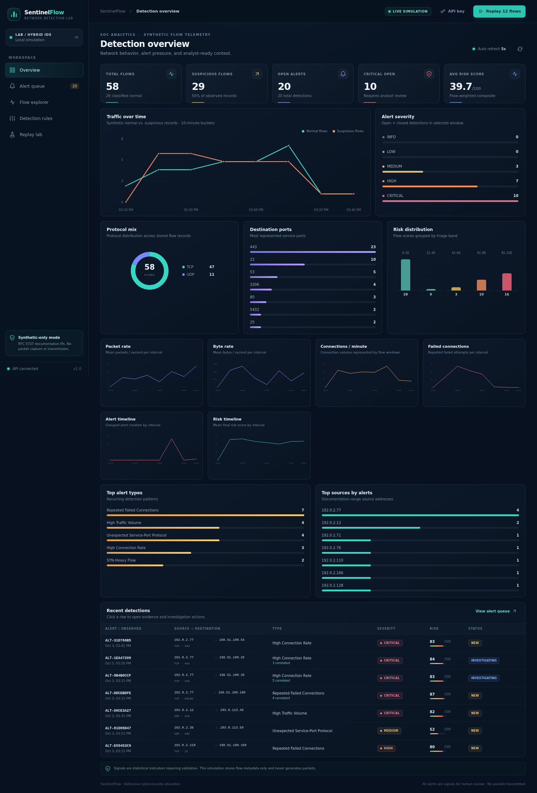
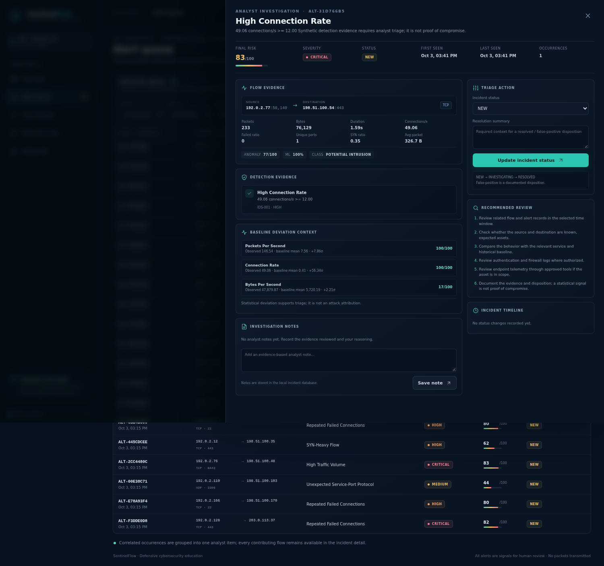

# SentinelFlow evidence gallery

These PNGs were captured from the actual local SentinelFlow application and local files using Playwright. They show synthetic/reserved-address flow metadata, a local API response, the SQLite demo database, and results measured by the included evaluation/test commands. No real network telemetry, packets, public target, credential, or personal data is involved.

## Re-capture locally

1. From the repository root, install the optional browser dependency:

   ```bash
   python -m pip install -r requirements-screenshots.txt
   python -m playwright install chromium
   ```

   On Debian/Ubuntu Linux, if Chromium reports missing system libraries, run `python -m playwright install-deps chromium` once (it needs system package-install permission).

2. In terminal 1, start the local demo API/dashboard. It seeds the demo database if it is empty:

   ```bash
   IDS_HOST=127.0.0.1 IDS_ENABLE_ML=true IDS_SEED_DEMO=true python run.py
   ```

   On PowerShell, use `$env:IDS_HOST='127.0.0.1'; $env:IDS_ENABLE_ML='true'; $env:IDS_SEED_DEMO='true'; python run.py`.

3. In terminal 2, run the capture script:

   ```bash
   python tools/capture_screenshots.py
   ```

The script targets only `http://127.0.0.1:8000`. It inserts one normal and one high-connection-rate **JSON flow record**, updates a local alert to `INVESTIGATING`, adds one idempotent example analyst note, runs `pytest -q`, and reads the included synthetic dataset and saved ML evaluation. It never generates packets or contacts another host. It does update the local, Git-ignored demo database. The `screenshots/` directory is the output location.

## Selected captures

### SOC overview



### Alert investigation



### Evidence and measured results

| Evidence | Capture |
|---|---|
| Synthetic flow + actual feature extraction | [05 normal flow](05-normal-flow-analysis.png) · [06 high-rate synthetic flow](06-synthetic-abnormal-flow.png) · [07 engineered features](07-feature-engineering.png) |
| Explainable detection + risk | [08 rule evidence](08-signature-rule-match.png) · [09 anomaly comparisons](09-anomaly-score.png) · [10 hybrid risk](10-hybrid-risk-score.png) |
| Alert workflow | [11 alert queue](11-alert-generated.png) · [18 analyst note](18-analyst-note.png) · [19 status/timeline](19-incident-status.png) |
| Dashboard panels | [13 traffic timeline](13-traffic-timeline.png) · [14 protocol mix](14-protocol-distribution.png) · [15 severity](15-alert-severity.png) · [16 alert types](16-top-alert-types.png) |
| Actual evaluation / project proof | [20 ML evaluation](20-ml-evaluation.png) · [21 confusion matrix](21-confusion-matrix.png) · [22 fresh test run](22-automated-tests.png) · [23 live API response](23-api-response.png) · [24 SQLite records](24-database-records.png) |
| Local docs / safe lab | [01 folder structure](01-project-structure.png) · [02 architecture](02-hybrid-ids-architecture.png) · [03 synthetic dataset](03-synthetic-dataset.png) · [04 CLI help](04-safe-simulator.png) · [04 replay lab](04-safe-simulator-lab.png) · [08 rule settings](08-rule-settings.png) |

GitHub-only evidence (commit history, repository settings, rendered README) is not fabricated; see the manual items in [`../docs/SCREENSHOT_CHECKLIST.md`](../docs/SCREENSHOT_CHECKLIST.md) after you publish your own repository.
